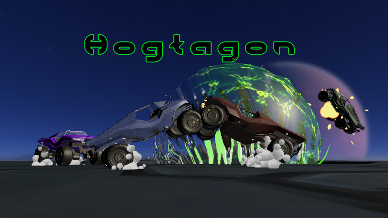

# Hogtagon

A physics-based multiplayer driving sumo game where you battle opponents in an arena using vehicular combat.

## About

Hogtagon is a personal project I built to develop my skills in Unity, multiplayer networking, and game development. It is inspired by a Halo 3 custom game and I wanted to use this project as a way to both recreate and try to expand upon that formula. 

The game features online multiplayer using Unity Netcode for GameObjects and Unity Relay Services to allow players to seamlessly connect with their friends. For the optimal experiance, 8 players is highly recomended. 

## Built With

- [Unity](https://unity.com/) - Game Engine
- C# - Programming Language
- [Unity Netcode for GameObjects](https://docs-multiplayer.unity3d.com/netcode/current/about/) - Multiplayer networking
- [Unity Relay](https://unity.com/products/relay) - Network relay service
- [Wwise](https://www.audiokinetic.com/en/wwise/overview/) - Audio Engine

## Credits

**Gennaro Cuomo** - Lead & Programming
**Daniel Ramirez** - Audio Design
**Charles Moore** - UX and Trailer
